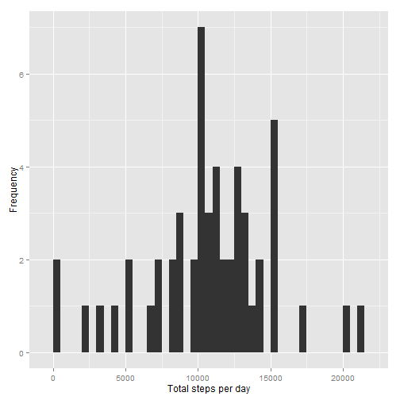
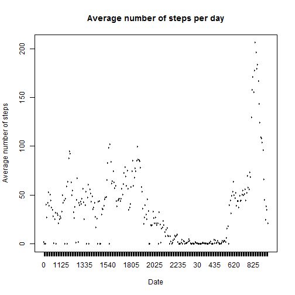
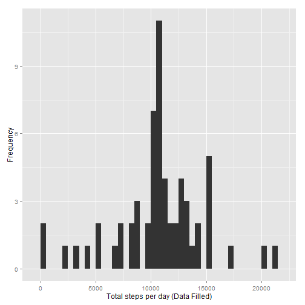

## Description

This file will detail the steps of obtaining the answer for the solution for the questions in assignment 1.

##Loading and preprocessing the data


```r
library(ggplot2)

data<-read.csv("activity.csv", colClasses = c("integer", "Date", "factor"))                                      ## reading the data

#data[is.na(data)] <- 0
```

## What is mean total number of steps taken per day?
- Ignoring N.A. values kni  

```r
total <-aggregate(data$steps,by=list(data$date),sum)

mean <-mean(total$x,na.rm=TRUE)
median <-median(total$x,na.rm=TRUE)
```

- Histogram of the total number of steps taken each day:

```r
qplot(total$x, xlab='Total steps per day', ylab='Frequency', binwidth=500)
```

 

- The mean for each day is:

```r
mean
```

```
## [1] 10766.19
```
- The median for each day is:

```r
median
```

```
## [1] 10765
```
## What is the average daily activity pattern?


```r
average <-aggregate(data$steps,by=list(interval = data$interval),mean,na.rm=TRUE)
plot(average$interval,average$x,xlab = "Date",ylab = "Average number of steps",type = "l",col="black")
  title(main = "Average number of steps per day")
```

 
## Which 5-minute interval, on average across all the days in the dataset, contains the maximum number of steps?


```r
average[average$x==max(average$x),]
```

```
##     interval        x
## 272      835 206.1698
```
## Number of missing values

```r
sum(is.na(data$steps))
```

```
## [1] 2304
```
## To minimise the impact of the missing value we will be filling the missing input with the average of that day

```r
dataFork<-data
missingFrame<-data[is.na(data),]
for (i in 1:nrow(missingFrame)) {
   dataFork[which(data$interval==missingFrame$interval[i] & data$date==missingFrame$date[i]),]$steps  <- average[which(missingFrame$interval[i] == average$interval), ]$x
   }
head(dataFork)
```

```
##       steps       date interval
## 1 1.7169811 2012-10-01        0
## 2 0.3396226 2012-10-01        5
## 3 0.1320755 2012-10-01       10
## 4 0.1509434 2012-10-01       15
## 5 0.0754717 2012-10-01       20
## 6 2.0943396 2012-10-01       25
```
- Histogram of the total number of steps taken each day (NA filled)

```r
total <-aggregate(dataFork$steps,by=list(dataFork$date),sum)
qplot(total$x, xlab='Total steps per day (Data Filled)', ylab='Frequency', binwidth=500)
```

 
- Report the mean and median total number of steps taken per day

```r
NewMean <-mean(total$x)
NewMedian <-median(total$x)
NewMean
```

```
## [1] 10766.19
```

```r
mean
```

```
## [1] 10766.19
```

```r
NewMedian
```

```
## [1] 10766.19
```

```r
median
```

```
## [1] 10765
```
 - Comparing the results of the new and old mean, the values are the same
 - Comparing the results of the new and old Median, the values of the new median is slightly higher
 - In conclusion , normalising the missing values with averaged interval value will not affect the results much.

## Differences in activity patterns between weekdays and weekends
-Create a new factor variable in the dataset with two levels -- "weekday" and "weekend" indicating whether a given date is a weekday or weekend day.


```r
dataFork$weekdays <- factor(format(dataFork$date, "%A"))
levels(dataFork$weekdays) <- list(weekday = c("Monday", "Tuesday",
                                             "Wednesday", 
                                             "Thursday", "Friday"),
                                 weekend = c("Saturday", "Sunday"))
levels(dataFork$weekdays)
```

```
## [1] "weekday" "weekend"
```

```r
table(dataFork$weekdays)
```

```
## 
## weekday weekend 
##   12960    4608
```
- panel plot containing a time series plot (i.e. type = "l") of the 5-minute interval (x-axis) and the average number of steps taken, averaged across all weekday days or weekend days (y-axis)

```r
avgSteps <- aggregate(dataFork$steps, 
                      list(interval = as.numeric(as.character(dataFork$interval)), 
                           weekdays = dataFork$weekdays),
                      FUN = "mean")
names(avgSteps)[3] <- "meanOfSteps"
library(lattice)
xyplot(avgSteps$meanOfSteps ~ avgSteps$interval | avgSteps$weekdays, 
       layout = c(1, 2), type = "l", 
       xlab = "Interval", ylab = "Number of steps")
```

 
